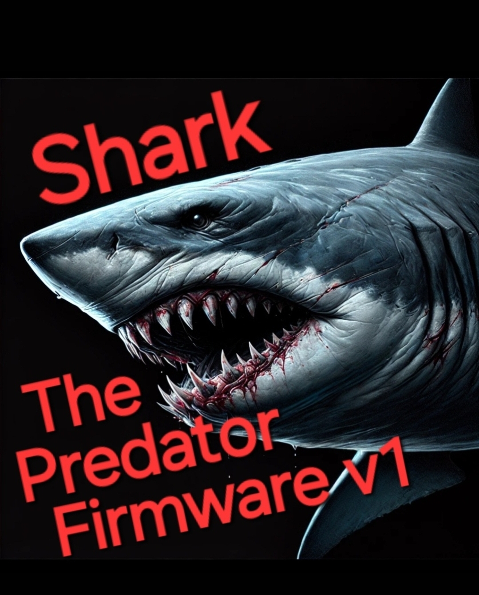

# Shark Predator Firmware v1

Advanced esp32 coding for ethical hacking

  

use this

- [x] esp32
- [ ] esp8266
- [ ] arduino uno
- [x] cc1101
- [x] TFT ILI9341 2.4 Touch
- [ ] other type of TFT
- [x] GPS neo 6m Module
- [x] SD Card

What Shark PredatorFirmware v1 is able to do ?

- [x] Capture RF Signal
- [x] Transmit Captured signal
- [ ] Play FM Radio
- [x] Jam WiFi
- [x] WiFi Captive Portal
- [x] Deauth Attack
- [x] Bluetooth Attacks
- [ ] Bad USB

<h1>INSTALATION</h1>

- Clone this repo
- GIVE A STAR ON THIS REPO PLEASE
- boild
